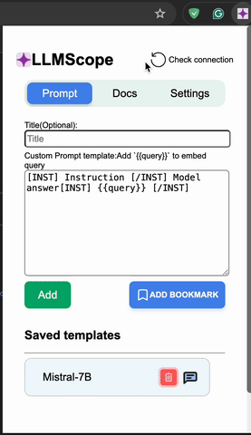

# <span style="color:skyblue">LLMScope</span>: Chrome extension for LLM Inference 

## Overview
A chrome extension integrated with RestAPIs for streaming Locally Deployed LLM services. I have deployed a FastAPI application locally to run the models. It leverages the use of local LLMs to enhance privacy and provide security from web attacks. It has web scraping tools and file ingestor to apply RAG functionality on responses. This extension is designed to handle various form elements including input fields, and text area.
### Demo


### User Interface


## Server Installation
```console
python3 fastapi/llm.py
```

## Acknowledgements
Resources like StackOverflow and Perplexity were crucial in helping to fix issues and improve the functionality of the LLM Bot for inference and RAG during the development phase.